<h1>LMS SOLUTION</h1>

This application is developed from HTML/ CSS/ Bootstrap V5.1.3, Frontend from Javascript and AJAX and backend from PHP 7.4.

This is a Library Database Application developed using Oracle. Following features are available in this Library Management System.

<ul>
    <li>Multi User Authentication (Admin / Chief Librarian / Staff)</li>
    <li>Manage Members (CRUD)</li>
    <li>Add Books (CRUD)</li>
    <li>Lend and Returning Books</li>
    <li>Option to extend return date</li>
    <li>Pay Fine</li>
    <li>Reports</li>
    <ul>
        <li>A report that displays book loan history of a student in a specific month</li>
        <li>A report that displays total fine paid by a student in a specific month</li>
    </ul>
</ul>

<h3>Screen Shots</h3>
Login.php
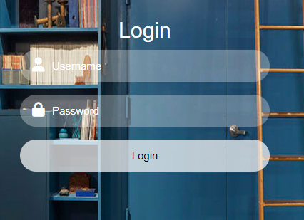

Dashboard
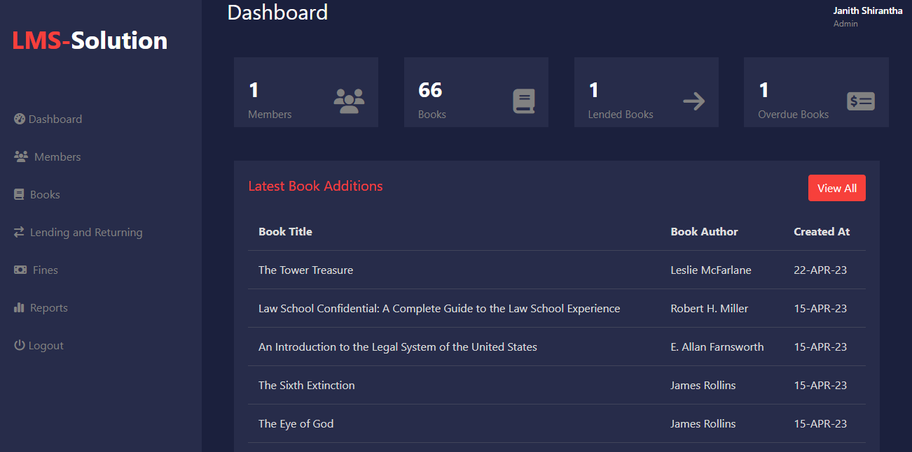

Members
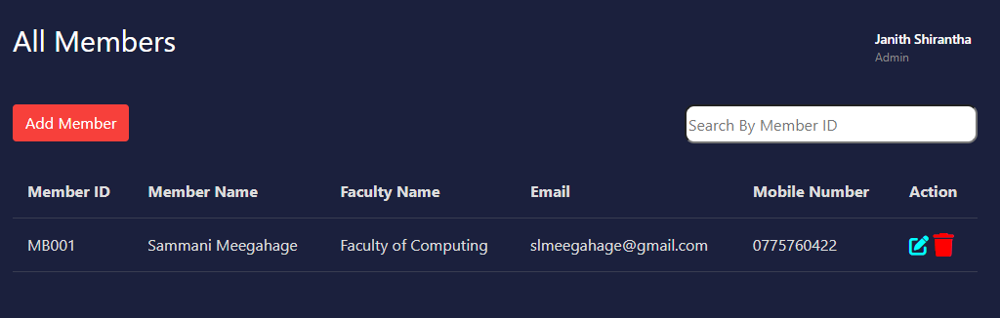
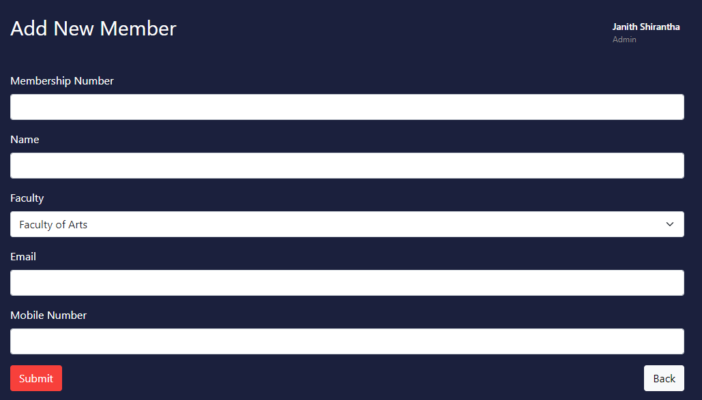

Books
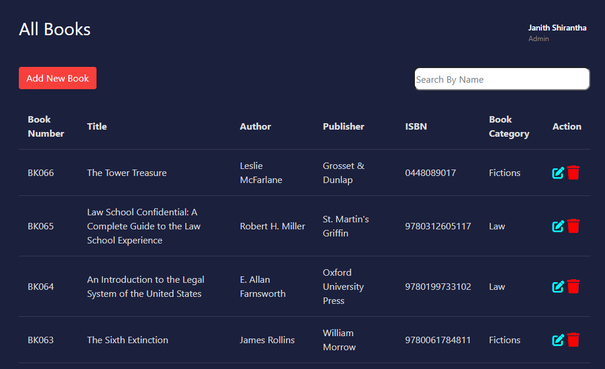
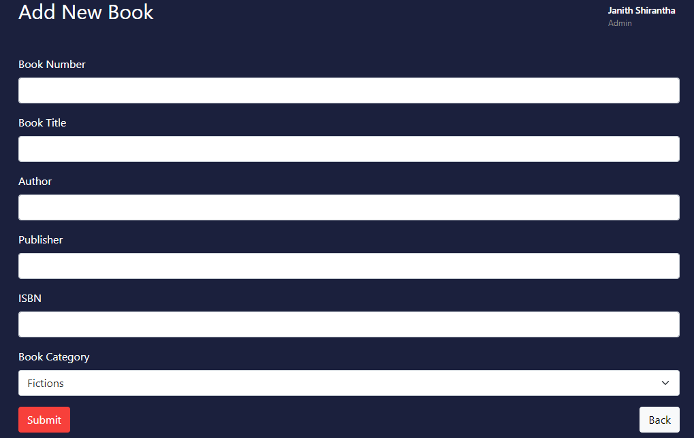
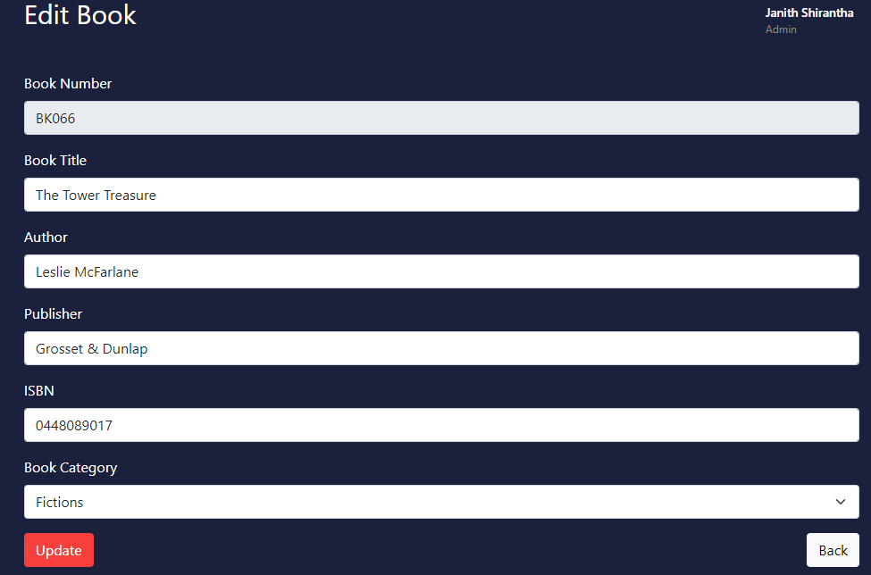

Lend and Return
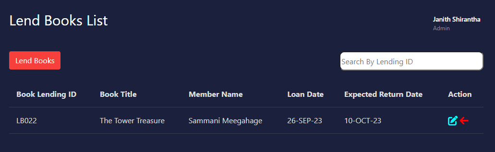
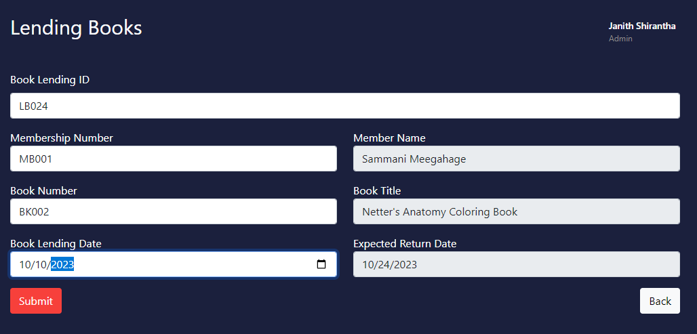
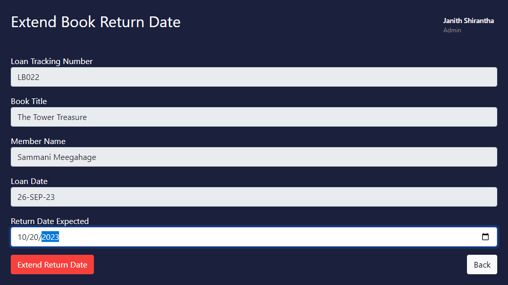
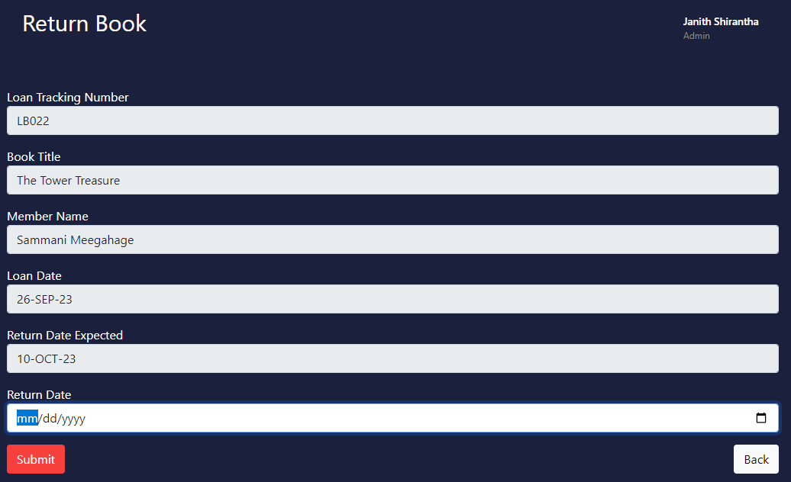

Fine Payments
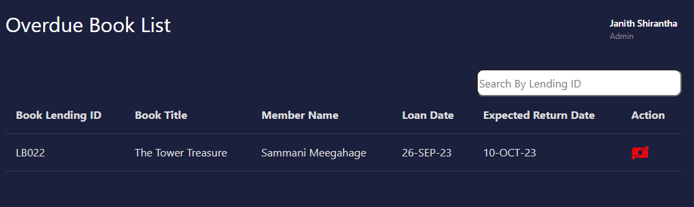
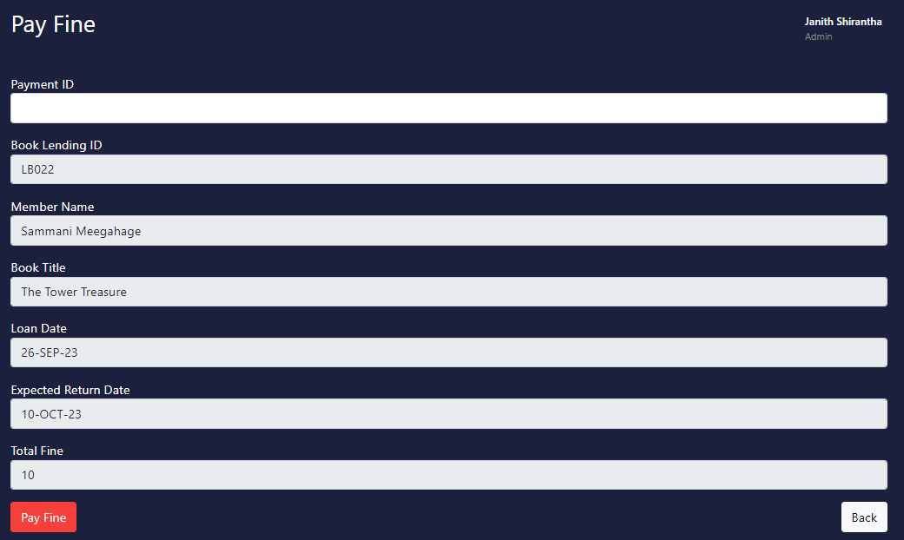

